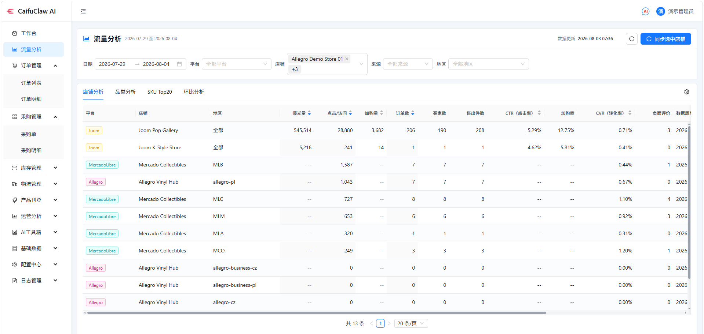
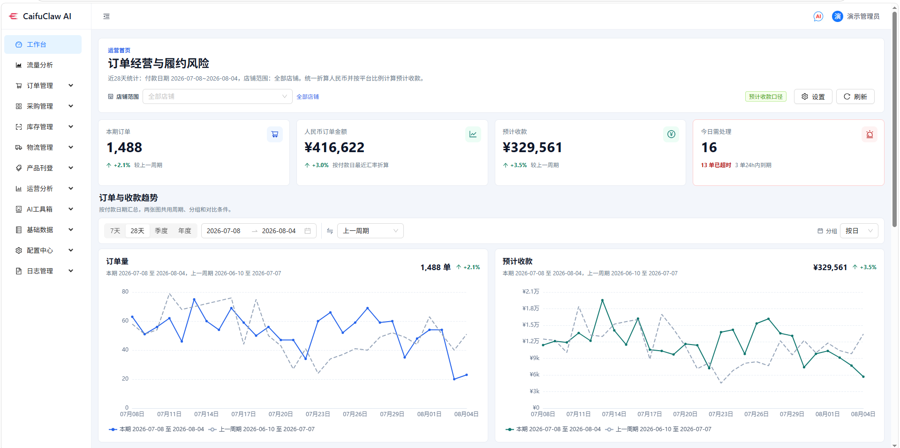
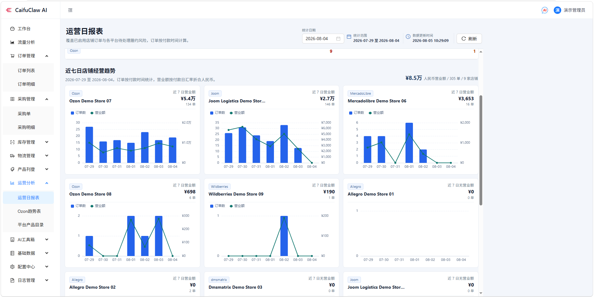

# CaiFuClaw AI

> 开源、本地运行、数据自主、支持按需定制的跨境电商 AI ERP。

CaiFuClaw AI 面向多平台、多店铺跨境电商团队，将订单同步、采购、库存、打单发货、运营报表、商品数据和平台连接能力集中到一个可自行部署的业务系统中。

项目采用前后端分离架构，核心经营数据存储在卖家自己的 PostgreSQL 数据库中。团队可以从演示环境开始，逐步接入真实店铺、物流规则和 AI 服务，不必让内部流程完全受制于固定的 SaaS 产品形态。

## 为什么选择 CaiFuClaw AI

- **本地运行与私有部署**：可部署在自己的电脑或服务器中，核心订单、库存、商品和运营数据由使用者管理。
- **开源可定制**：采用 Apache-2.0 许可证，可查看源码并根据实际业务流程进行二次开发。
- **多平台统一处理**：通过独立的连接器服务适配不同平台的认证、订单、履约和面单接口。
- **覆盖履约主流程**：集中处理订单、采购、库存、打印、出库扫描、物流规则和状态回传。
- **运营数据可视化**：提供工作台、流量分析、运营日报、订单汇总和同步日志等管理页面。
- **AI 辅助工具**：支持文字翻译、文生图、图片修改、拆分与合并；AI 服务商和模型可按需配置。
- **数据与操作可追溯**：提供用户权限、任务日志、API 日志和关键业务操作记录。

本地部署并不代表所有数据永远不会离开本机。连接电商平台、物流接口或外部 AI 服务时，相关请求仍会按照对应服务商的接口规则发送。生产环境应仔细配置访问权限、网络边界和数据使用策略。

## 已实现能力

| 业务领域 | 当前能力 |
| --- | --- |
| 店铺与平台 | 店铺凭据管理、OAuth/密钥配置、订单同步、履约状态回传、连接日志 |
| 订单履约 | 订单列表与汇总、订单详情、采购衔接、打印预览、出库扫描、物流跟踪 |
| 商品与库存 | 产品档案、平台商品目录同步、内部商品映射、库存查询、定价与利润规则计算 |
| 采购管理 | 采购单、采购明细、到货与订单关联流程 |
| 运营分析 | 工作台、订单趋势、预计收款、利润数据、流量分析、运营日报 |
| 物流配置 | 物流授权、平台物流规则、承运渠道配置和面单处理 |
| AI 工具 | 多语言文字翻译、AI 生图、图片编辑、智能拆图、图片拼接 |
| 系统管理 | 用户与权限、系统参数、汇率、定时任务、同步日志、API 日志 |

完整的自主运营智能体、动态插件市场、微信告警、财税申报和广告服务连接仍属于后续演进方向，不作为当前版本已经完成的能力承诺。

## 产品界面

以下截图使用演示店铺和脱敏数据。

### 流量分析



### 订单经营工作台



### 运营日报



## 系统架构

CaiFuClaw AI 由两个 Python 服务和一个 React 前端组成：

- `caifuclaw_business_app`：业务 API 与 React 管理端，负责店铺配置、订单、采购、库存、打印、汇率、报表、AI 工具和系统管理。
- `connector_runtime`：平台连接器运行时，负责平台 API 适配、字段标准化、订单获取、履约回传和面单下载。
- PostgreSQL：保存业务数据、配置数据和运行记录。

业务应用通过 HTTP 调用连接器服务，不直接导入具体平台适配代码。这样可以将核心业务流程与外部平台接口变化分离，便于维护和扩展。

## 平台连接器

仓库目前包含 Amazon、TikTok Shop、AliExpress、Shopee、Lazada、Shopify、eBay、Walmart、Temu、SHEIN、Wayfair、Allegro、Ozon、Coupang、Joom、Mercado Libre、Wildberries 等平台或服务的适配代码。

连接器是否可直接用于生产取决于平台开放区域、卖家账号类型、API 权限、认证材料和接口版本。正式上线前应使用自己的平台沙箱或真实授权环境完成联调验证。

## 快速开始

### 环境要求

- Python 3.11+
- Node.js 20+
- PostgreSQL 14+
- Windows 10/11 或 Windows Server 为主要支持环境

macOS 可使用仓库提供的 `launchd` 守护脚本。Linux 可以运行 Python 服务，但目前没有随项目提供服务安装器。

### 安装与启动

```powershell
python -m venv .venv
.\.venv\Scripts\Activate.ps1
pip install -r requirements.txt
pip install -r caifuclaw_business_app\requirements.txt
pip install -r connector_runtime\requirements.txt

Push-Location caifuclaw_business_app\frontend
npm ci
Pop-Location

Copy-Item caifuclaw_business_app\config.template.toml caifuclaw_business_app\config.toml
```

修改复制后的 `config.toml`，填写 PostgreSQL 连接信息和需要启用的外部服务配置。不要将店铺密钥、AI 服务密钥、客户数据、日志或导出文件提交到 Git。

安装包含脱敏演示数据的数据库：

```powershell
.\deploy\database\install_demo_database.cmd
```

演示数据库提供 `testadmin` / `TestPass123!` 登录账号。生产环境必须修改所有默认值。如果需要空数据库，请改用：

```powershell
python scripts\init_databases.py
```

构建并启动服务：

```powershell
.\build_caifuclaw_erp.cmd
.\start_caifuclaw_erp.cmd -Restart
```

启动后访问：

- 管理端与业务 API：`http://127.0.0.1:9999`
- 连接器健康检查：`http://127.0.0.1:8100/health`

## 开发与测试

日常构建和重启：

```powershell
.\build_caifuclaw_erp.cmd
.\start_caifuclaw_erp.cmd -Restart
```

常用测试命令：

```powershell
# React 前端
Push-Location caifuclaw_business_app\frontend
npm test -- --run
Pop-Location

# 业务服务
Push-Location caifuclaw_business_app
python -m pytest -q
Pop-Location

# 连接器服务
Push-Location connector_runtime
python -m pytest -q
Pop-Location
```

## 生产部署与安全

生产环境必须设置 `CAIFUCLAW_AI_ENV=production`，并确保连接器端口 `8100` 仅允许业务服务访问。历史的 `CAIFUCLAW_ERP_*` 环境变量和 `*_erp` 命令包装器仍保留兼容性。

部署前请阅读 [部署指南](docs/deployment.md)，完成 HTTPS、数据库备份、配置文件权限、内部服务令牌和服务重启策略的设置。

## 项目文档

- [安全策略](SECURITY.md)
- [参与贡献](CONTRIBUTING.md)
- [行为准则](CODE_OF_CONDUCT.md)
- [部署指南](docs/deployment.md)
- [开源发布检查清单](docs/open-source-release.md)
- [资源来源与许可证](ASSETS.md)
- [第三方依赖许可证](THIRD_PARTY_LICENSES.md)
- [更新日志](CHANGELOG.md)

## 许可证

项目源码采用 [Apache License 2.0](LICENSE) 许可证。产品名称和标识仍受商标规则保护，详见 [TRADEMARKS.md](TRADEMARKS.md)。
