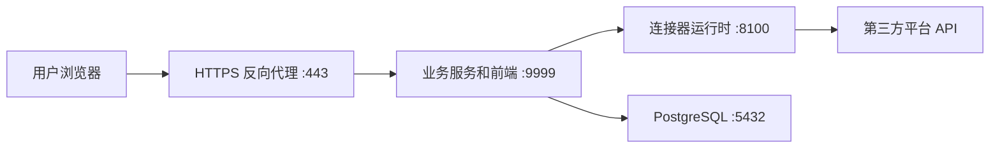

# CaifuClaw AI 安装与部署手册

本文档说明当前仓库支持的 CaifuClaw AI 安装、生产部署、验证和维护流程。Windows 是主部署平台；macOS 提供了仓库内置的 `launchd` 守护脚本。当前仓库没有 Linux 服务安装脚本，Linux 部署应由运维团队根据本文件的端口、环境变量和启动命令配置相应的进程管理器。

## 1. 架构与端口



| 服务 | 默认监听地址 | 用途 | 对外暴露 |
| --- | --- | --- | --- |
| 业务服务 | `0.0.0.0:9999` | FastAPI、React 前端静态文件和业务 API | 仅通过 HTTPS 反向代理 |
| 连接器运行时 | `127.0.0.1:8100` | 市场平台 API 适配器 | 否 |
| PostgreSQL | 按数据库配置 | 业务数据 | 否 |

前端生产文件由业务服务从 `caifuclaw_business_app/frontend/dist` 提供。不要在生产环境运行 Vite 开发服务或暴露端口 `5173`。连接器端口 `8100` 必须保持私有；业务服务会使用同一配置文件中的内部服务令牌访问它。

## 2. 前置条件

准备一台 Windows 10/11 或 Windows Server 主机，并安装：

- Python 3.11 或更高版本
- Node.js 20 或更高版本
- PostgreSQL 14 或更高版本
- Git
- 可选：Nginx 或同类 HTTPS 反向代理

生产主机还应具备稳定的出站 HTTPS 网络，以访问各个市场平台 API；不要将 PostgreSQL、`8100` 或 `9999` 直接暴露到互联网。

以下示例假定项目目录为 `D:\apps\caifuclaw_erp`。将路径替换为实际部署目录。

## 3. 获取代码和安装依赖

在 PowerShell 中执行：

```powershell
git clone <repository-url> D:\apps\caifuclaw_erp
Set-Location D:\apps\caifuclaw_erp

python -m venv .venv
.\.venv\Scripts\Activate.ps1
python -m pip install --upgrade pip
python -m pip install -r caifuclaw_business_app\requirements.txt -r connector_runtime\requirements.txt

Push-Location caifuclaw_business_app\frontend
npm ci
Pop-Location
```

如 PowerShell 阻止虚拟环境激活，请按企业安全策略调整当前用户的执行策略，或使用已获批准的 Python 运行时。后续构建和启动必须在该虚拟环境已激活、且 `python` 指向该环境的 PowerShell 会话中执行。

## 4. 配置 PostgreSQL

建议创建专用 PostgreSQL 用户和数据库。首次初始化时，配置中的用户需要能够在 `maintenance_database` 中创建目标数据库；数据库创建完成后，可按组织的权限策略收紧其权限。

示例 SQL：

```sql
CREATE USER caifuclaw WITH PASSWORD 'replace-with-a-strong-password';
ALTER USER caifuclaw CREATEDB;
```

请确保 PostgreSQL 仅接受受信任网络或本机连接，并完成常规的备份、监控和补丁维护。

## 5. 创建生产配置

从模板创建本机配置文件。该文件已被 `.gitignore` 忽略，绝不能提交到 Git。

```powershell
Copy-Item caifuclaw_business_app\config.template.toml caifuclaw_business_app\config.toml
```

生产配置至少需要替换以下字段；保留模板中的其他配置段，并按实际启用的平台填写 OAuth、对象存储和汇率配置。

```toml
[postgres]
host = "127.0.0.1"
port = 5432
user = "caifuclaw"
password = "replace-with-a-strong-password"
maintenance_database = "postgres"

[databases]
sync = "caifuclaw_ai_sync"

[services]
connector_runtime_url = "http://127.0.0.1:8100"
public_base_url = "https://erp.example.com"

[security]
sync_secret_key = "replace-with-a-random-value-of-at-least-32-characters"
fernet_key = "replace-with-a-generated-fernet-key"
internal_service_token = "replace-with-a-random-value-of-at-least-32-characters"
allowed_origins = ["https://erp.example.com"]

[storage]
label_storage_root = "data/labels"

[sync_admin]
username = "admin"
password = "replace-with-a-strong-password-of-at-least-12-characters"
```

可使用以下命令生成机密值：

```powershell
python -c "import secrets; print(secrets.token_urlsafe(48))"
python -c "from cryptography.fernet import Fernet; print(Fernet.generate_key().decode())"
```

`sync_secret_key`、`internal_service_token`、PostgreSQL 密码和管理员密码均应使用不同的随机值。`fernet_key` 用于加密存储的平台凭据；丢失它会导致已有凭据无法解密，因此应将其安全备份到组织认可的密钥管理系统。

生产环境必须设置 `CAIFUCLAW_AI_ENV=production`，或设置 `CAIFUCLAW_AI_REQUIRE_SECURE_CONFIG=1`。启用后，启动会拒绝占位符、过短或缺失的安全配置。旧版 `CAIFUCLAW_ERP_*` 变量仍作为兼容别名保留。

```powershell
$env:CAIFUCLAW_AI_ENV = "production"
```

如果配置需要存放在项目目录外，请在启动两个服务的同一账户环境中设置绝对路径：

```powershell
$env:CAIFUCLAW_AI_CONFIG_FILE = "D:\secure-config\caifuclaw\config.toml"
```

将环境变量配置到服务管理器或系统环境后，重新打开启动该服务的 PowerShell 会话，以确保新环境变量生效。业务服务和连接器运行时必须读取同一个配置文件，尤其是 `security.internal_service_token`。

### OAuth 回调地址

`services.public_base_url` 必须是用户和市场平台均可访问的 HTTPS 域名，且不应带尾部斜杠。模板中已配置的 `oauth.joom_logistics.redirect_uri`、`oauth.allegro.redirect_uri` 和 `oauth.mercadolibre.redirect_uri` 默认指向本机地址；生产环境启用对应平台时，必须将这些回调地址改为对应的公网 HTTPS 回调地址，并在平台后台登记完全一致的地址。

示例：

```toml
[oauth.allegro]
redirect_uri = "https://erp.example.com/api/allegro/callback"
```

## 6. 初始化数据库

在项目根目录、虚拟环境已激活的 PowerShell 中运行应用初始化脚本。该脚本会创建不存在的数据库和业务表，重复执行是安全的。

```powershell
$ProjectRoot = (Get-Location).Path
$env:PYTHONPATH = "$(Join-Path $ProjectRoot 'caifuclaw_business_app');$ProjectRoot"
Push-Location caifuclaw_business_app
python -m scripts.init_databases
Pop-Location
```

若 PostgreSQL 用户没有创建数据库的权限，请由数据库管理员预先创建 `[databases].sync` 指定的数据库，并使配置用户成为该数据库的所有者，再执行上述命令创建表结构。

## 7. 构建、启动和验证

项目根目录提供了统一构建和启动脚本。默认构建会把前端产物写入临时目录后删除，因此不会误改已跟踪的 `dist` 文件；启动脚本在检测到前端过期时会生成实际运行所需的 `dist`，而 `-Restart` 会强制重新构建并重启两个服务。

```powershell
.\build_caifuclaw_erp.cmd
.\start_caifuclaw_erp.cmd -Restart
```

启动脚本会：

1. 停止由本项目启动的旧进程。
2. 构建业务前端静态文件。
3. 启动连接器运行时 `127.0.0.1:8100`。
4. 启动业务服务 `0.0.0.0:9999`。
5. 对两个健康检查端点进行轮询。

部署后在服务器本机验证：

```powershell
Invoke-RestMethod http://127.0.0.1:8100/health
Invoke-RestMethod http://127.0.0.1:9999/health
Invoke-WebRequest -UseBasicParsing http://127.0.0.1:9999/
```

预期两个健康检查均返回成功状态，最后一个命令返回业务前端页面。日志位于：

- `connector_runtime/logs/connector_runtime_api.current.out.log`
- `connector_runtime/logs/connector_runtime_api.current.err.log`
- `caifuclaw_business_app/logs/caifuclaw_business_api.current.out.log`
- `caifuclaw_business_app/logs/caifuclaw_business_api.current.err.log`

若只需要将构建产物写入项目的 `dist` 目录，可使用：

```powershell
.\build_caifuclaw_erp.cmd -WriteFrontendDist
```

## 8. 配置 HTTPS 反向代理

生产环境应只让 HTTPS 反向代理对外提供访问。以下为 Nginx 的最小示例，证书路径、域名和上传大小应按实际环境调整：

```nginx
server {
    listen 80;
    server_name erp.example.com;
    return 301 https://$host$request_uri;
}

server {
    listen 443 ssl http2;
    server_name erp.example.com;

    ssl_certificate     /etc/nginx/certs/erp.example.com.crt;
    ssl_certificate_key /etc/nginx/certs/erp.example.com.key;
    client_max_body_size 100m;

    location / {
        proxy_pass http://127.0.0.1:9999;
        proxy_http_version 1.1;
        proxy_set_header Host $host;
        proxy_set_header X-Real-IP $remote_addr;
        proxy_set_header X-Forwarded-For $proxy_add_x_forwarded_for;
        proxy_set_header X-Forwarded-Proto $scheme;
        proxy_read_timeout 120s;
    }
}
```

配置完成后，从外部网络访问 `https://erp.example.com/`，并确认浏览器开发者工具中 API 请求、登录和已启用平台的 OAuth 回调均使用 HTTPS。防火墙规则应仅向反向代理或受信任管理网络开放 `9999`；不得开放 `8100` 或 PostgreSQL 的公网入站访问。

## 9. 常驻运行

### Windows

仓库提供 `start_caifuclaw_erp.cmd` 作为启动和重启入口。将其交由企业批准的 Windows 服务管理器或计划任务运行时，应使用专用服务账户，并确保该账户具备以下条件：

- `python` 指向项目的 `.venv`；
- 能读取 `CAIFUCLAW_AI_ENV` 和可选的 `CAIFUCLAW_AI_CONFIG_FILE`；
- 对项目的 `logs`、`data` 和配置定义的存储目录具有读写权限；
- 在机器启动、进程退出和版本升级后执行 `.\start_caifuclaw_erp.cmd -Restart`。

服务管理器的工作目录应设置为项目根目录。部署前请在该服务账户下手动运行一次第 7 节的命令并完成健康检查。

### macOS

macOS 使用仓库内的 `launchd` watchdog。完成依赖安装与配置后执行：

```bash
chmod +x deploy/macos/*.sh
deploy/macos/install_caifuclaw_erp_launchd.sh
```

查看状态和日志：

```bash
launchctl print "gui/$(id -u)/com.caifuclaw-erp.watchdog"
tail -f logs/watchdog/watchdog.log
```

卸载 watchdog：

```bash
deploy/macos/uninstall_caifuclaw_erp_launchd.sh
```

watchdog 会检查 `9999` 和 `8100` 的健康状态，并在前端源文件较新或静态资源缺失时重建前端。详细行为见 `docs/macos-watchdog.md`。

## 10. 备份、恢复和升级

上线前先完成一次可验证的备份，并将备份复制到独立于应用服务器的受控存储中。

仅备份 PostgreSQL：

```powershell
python deploy\database\backup_postgres.py `
  --config caifuclaw_business_app\config.toml `
  --backup-dir D:\caifuclaw-backups\postgres `
  --retention-days 30 `
  --include-globals
```

创建包含 PostgreSQL、标签文件、列表文件和运行时配置的完整快照：

```powershell
python deploy\database\backup_all.py `
  --config caifuclaw_business_app\config.toml `
  --business-config caifuclaw_business_app\config.toml `
  --backup-dir D:\caifuclaw-backups\full `
  --retention-days 30
```

恢复或重建导出的 SQL 前，先在隔离环境演练。`deploy/database/upgrade_database.py --replace` 会删除并重建目标数据库，只能在已确认的恢复操作中使用。数据库操作的完整说明见 `deploy/database/README.md`。

常规版本升级顺序：

```powershell
Set-Location D:\apps\caifuclaw_erp
.\.venv\Scripts\Activate.ps1
git pull --ff-only
python -m pip install -r caifuclaw_business_app\requirements.txt -r connector_runtime\requirements.txt
Push-Location caifuclaw_business_app\frontend
npm ci
Pop-Location
.\build_caifuclaw_erp.cmd
.\start_caifuclaw_erp.cmd -Restart
```

升级前备份，升级后执行第 7 节的健康检查和关键业务流程验证。若升级包含数据库变更，先阅读该版本的发布说明和 `deploy/database` 下的迁移文件。

## 11. 故障排查清单

| 现象 | 检查方式 |
| --- | --- |
| 服务未通过健康检查 | 检查第 7 节列出的标准输出和错误日志；确认 PostgreSQL 可连接。 |
| 端口被占用 | `Get-NetTCPConnection -LocalPort 9999,8100 -State Listen`，确认占用进程是否为本项目服务。 |
| 前端显示旧版本或资源 404 | 执行 `.\start_caifuclaw_erp.cmd -Restart` 以强制重建前端；不要手动删除其他人正在使用的 `dist` 文件。 |
| 连接器返回 401 或 503 | 确认业务服务和连接器读取同一配置文件，且 `security.internal_service_token` 已设置为至少 32 个字符。 |
| OAuth 回调失败 | 检查 `public_base_url`、相应的 `oauth.*.redirect_uri`、HTTPS 证书和平台后台回调白名单是否完全一致。 |
| 生产启动被安全检查拒绝 | 设置 `CAIFUCLAW_AI_ENV=production` 后，替换所有占位符、短密钥或缺失的 `fernet_key`。 |

部署完成后，应保留本文件中的健康检查、日志位置、备份任务、反向代理配置和服务管理方式作为交付记录。
